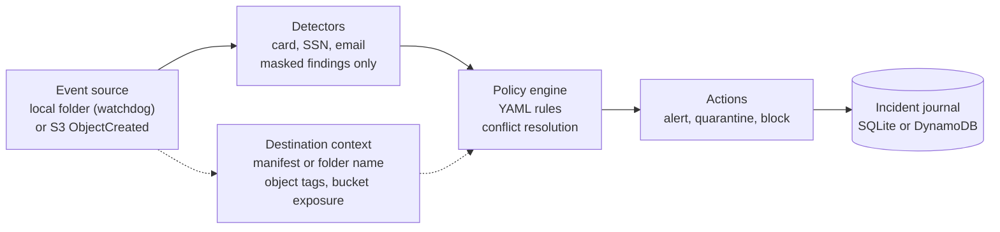
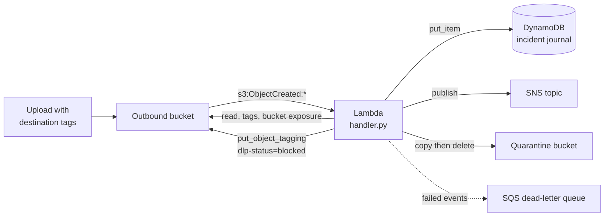

# Simple DLP Policy Engine

An event-driven, rule-based data loss prevention (DLP) engine. It reacts to files appearing in a
folder or in an S3 bucket, looks for sensitive data (payment cards, SSNs, email addresses),
works out where the file is going, and applies policies written in YAML: **alert**,
**quarantine** or **block** when sensitive data is headed somewhere risky.

One core, two deployments:

| | Local mode | AWS mode |
|---|---|---|
| Event source | `watchdog` filesystem events on an "outgoing" folder | S3 `ObjectCreated` event notification |
| Compute | Python process (`cli.py watch start`) | AWS Lambda |
| Destination context | manifest next to the file, or folder name | object tags + bucket exposure |
| Alert | console, JSON log, Slack/Discord/generic webhook | SNS (+ optional webhook) |
| Quarantine | move to a private folder | copy to a quarantine bucket, delete the original |
| Block | access removed + marker file (simulation) | `dlp-status=blocked` tag, bucket policy denies reads |
| Incident journal | SQLite | DynamoDB |

Everything in this repository (examples, seed script, tests) uses synthetic data generated with
[Faker](https://faker.readthedocs.io). There are no real card numbers or personal data anywhere.

## Why this project

Enterprise DLP products (endpoint agents, secure email gateways, CASB, cloud-native scanners)
all follow the same loop: **classify the content, understand the context, decide by policy,
enforce a response, keep an audit trail**. Sensitive content is not a problem by itself; a card
number in an internal finance share is normal, the same number in an email to a personal address
or in a public bucket is an incident. Job descriptions for Data Security Engineers ask for
exactly this skill set: writing and tuning DLP policies, reducing false positives, understanding
endpoint versus cloud DLP, and wiring detection to response and reporting.

This project is a small, readable implementation of that loop that runs on a laptop or in a
personal AWS account:

* **endpoint-style DLP**: a watcher in front of an "outbox" that sees every file before it is
  sent, and
* **cloud-style DLP**: an event-driven function that inspects every object that lands in a bucket
  and reacts after the fact.

Both feed the same pipeline, so a policy is written once and behaves the same way in both.
What is real and what is simulated is spelled out under [Limitations](#limitations).

## Architecture



The flow for one file is always **event source → detector → policy engine → action → journal**:

1. **Event source** obtains the bytes and describes the destination (`src/watchers`).
2. **Detectors** turn text into findings. A finding holds the data type, a *masked* value and a
   position, never the raw value (`src/detectors`).
3. **Policy engine** matches findings and destination categories against the rules and resolves
   conflicts between rules that fired together (`src/engine`).
4. **Actions** enforce the winning decision: disposition first (quarantine or block), then the
   alert, so the alert can report whether enforcement worked (`src/actions`).
5. **Journal** records one structured incident per triggered rule (`src/storage`).

`src/pipeline.py` is the only place that knows the whole chain; both modes call it.

```
.
├── cli.py                    # policy validate/test, incident-log query, watch start
├── config/policies.example.yaml
├── lambda/handler.py         # AWS Lambda entrypoint (thin wiring around the pipeline)
├── infra/terraform/          # S3, Lambda, DynamoDB, SNS, SQS dead-letter queue, IAM
├── scripts/
│   ├── seed_test_files.py    # Faker-generated test files, local or S3
│   ├── build_lambda.py       # builds build/lambda.zip
│   └── invoke_handler.py     # run the real handler locally against S3/LocalStack
├── src/
│   ├── detectors/            # card (Luhn + issuer prefix), SSN, email
│   ├── engine/               # policy loader, conditions, PolicyEngine, destination model
│   ├── watchers/             # local watcher (watchdog), S3 event source
│   ├── actions/              # alert (+ notifiers), quarantine, block
│   ├── storage/              # SQLite and DynamoDB incident stores
│   └── pipeline.py
└── tests/
```

## Policy language

Rules are declarative YAML. Nothing about what counts as an incident is hard-coded.

```yaml
version: 1

settings:
  corporate_domains: [corp.example.com]     # recipients in these domains are "internal"
  trusted_domains: [partner.example.net]    # get the extra "trusted_domain" category
  conflict_resolution: priority             # or: most_restrictive

rules:
  # Card numbers OR SSNs heading to a risky destination.
  - rule: card_data_to_external
    description: Payment card or SSN data leaving through a risky channel.
    severity: high
    condition:
      contains: [credit_card, ssn]
      destination: [external_email, public_s3, non_corporate_domain]
    action: [alert, quarantine]

  # Threshold: more than 3 card numbers in one file. Wins over the rule above.
  - rule: bulk_card_data_to_risky_destination
    severity: critical
    priority: 90
    condition:
      all_of:
        - contains:
            - type: credit_card
              min_count: 4
        - destination: [external_email, public_s3, cloud_storage, non_corporate_domain, removable_media]
    action: [alert, block]

  # Exception: small transfers to a trusted partner are only reported.
  - rule: trusted_partner_small_transfer
    severity: low
    priority: 200
    condition:
      all_of:
        - contains: [credit_card, ssn]
        - destination: [trusted_domain]
        - not:
            contains:
              - type: credit_card
                min_count: 4
    action: [alert]
```

The full example with every rule is in [`config/policies.example.yaml`](config/policies.example.yaml).
Check a policy with `python cli.py policy validate <file>`.

### Syntax

| Key | Meaning |
|---|---|
| `rule` | Unique name (letters, digits, `_`, `-`, `.`). |
| `severity` | `low`, `medium`, `high`, `critical`. |
| `priority` | Optional, 0 to 1000, higher wins a conflict. Default 10/20/30/40 by severity. |
| `enabled` | Optional, `false` switches a rule off without deleting it. |
| `action` | List of `alert`, `quarantine`, `block`. |
| `condition` | A mapping of the keys below. Side-by-side keys are combined with **AND**. |

Condition keys:

| Key | Holds when |
|---|---|
| `contains: [a, b]` | **any** of the listed data types was found (`credit_card`, `ssn`, `email`) |
| `contains_all: [a, b]` | **every** listed type was found |
| `destination: [x, y]` | the destination belongs to **any** of the listed categories |
| `all_of: [...]` / `any_of: [...]` | all / at least one nested condition holds (AND / OR) |
| `not: {...}` | the nested condition does not hold |

Entries of `contains` may be written `{type: credit_card, min_count: 4}` and also take
`max_count`. "More than 3 cards" is therefore `min_count: 4`.

Destination categories: `external_email`, `internal_email`, `public_s3`, `private_s3`,
`cloud_storage`, `removable_media`, `non_corporate_domain`, `corporate_domain`, `trusted_domain`,
`internal`, `unknown`. `unknown` means the source could not tell where the file goes; a rule can
list it to fail closed.

The loader is strict: unknown keys, data types, categories or actions, duplicate YAML keys,
out-of-range numbers and over-deep nesting are all errors, with a suggestion where there is a
close match (`unknown data type 'credit_cards' (did you mean 'credit_card'?)`). All problems
are reported in one run. A typo in a security policy must not become a rule that silently never
fires.

### Conflicts between rules

Several rules can fire for one file. Every one of them is recorded as its own incident, but only
one set of actions is applied:

* `priority` (default): the matching rules with the **highest priority** decide. Lower-priority
  matches are still journaled, flagged `suppressed_by`. This is how an exception such as
  `trusted_partner_small_transfer` overrides a broader rule.
* `most_restrictive`: the actions of **all** matching rules are combined; priority is ignored.

In both modes `alert` is additive, and a file gets at most one *disposition*: quarantine and
block are mutually exclusive and **block wins**. A rule that lists both is accepted with a
warning from `policy validate`.

### Where the destination comes from

There is no real mail or upload traffic to inspect, so the destination is *described* and then
turned into the categories above.

**Local mode** (first match wins):

1. `<file>.meta.json`, a manifest for that file
2. `metadata.json`, a manifest for a folder (nearest ancestor up to the watch root)
3. a folder name under the watch root that is a category, e.g. `outbox/external_email/report.csv`
4. otherwise `unknown`

```json
{"channel": "email", "recipient": "buyer@vendor.example.org"}
```

`channel` is one of `email`, `s3`, `cloud_storage`, `removable_media`, `internal`; `destination`
may add categories directly; `recipient`/`domain` are checked against `corporate_domains` and
`trusted_domains`. Write the manifest before (or together with) the file.

**AWS mode:**

* object tags: `dlp-destination=external_email` (several categories joined with `+`, since S3 tag
  values cannot contain commas) and `dlp-recipient=buyer@vendor.example.org`
* bucket exposure: a public ACL grant, a public bucket policy, taking Block Public Access into
  account. A readable-by-everyone bucket yields `public_s3`, otherwise `private_s3`.

## Running locally

```bash
python3 -m venv .venv && source .venv/bin/activate
pip install -r requirements.txt

cp config/policies.example.yaml config/policies.yaml
python cli.py policy validate config/policies.yaml
```

Start the watcher, then drop in the synthetic files:

```bash
python cli.py watch start --watch-dir ./outbox --log-file data/incidents.jsonl   # terminal 1
python scripts/seed_test_files.py local --out ./outbox                           # terminal 2
```

The watcher prints an alert per file (values are masked), quarantines or blocks as the policy
says, and records incidents in SQLite (`data/incidents.db`) and, with `--log-file`, as JSON lines:

```
ALERT [DLP][HIGH] card_data_to_external
source: ./outbox/customers_q1.csv
destination: external_email, non_corporate_domain
enforcement: quarantine
findings: credit_card x3 (****-****-****-0132, ****-****-****-9400, ****-****-****-1553)

ALERT [DLP][CRITICAL] bulk_card_data_to_risky_destination
source: ./outbox/public_s3/card_dump.csv
destination: public_s3
enforcement: block
findings: credit_card x6 (****-****-****-5345, ****-****-****-5030, ****-****-****-6721)
also matched (overridden by priority): card_data_to_external

ALERT [DLP][LOW] trusted_partner_small_transfer
source: ./outbox/invoice_batch.txt
destination: external_email, non_corporate_domain, trusted_domain
enforcement: none (alert only)
findings: credit_card x2 (****-****-****-0518, ****-****-****-7630)
```

`python scripts/seed_test_files.py list` describes each scenario and its expected outcome; the
test suite checks that the generated data really produces it.

Query the journal:

```bash
python cli.py incident-log query --severity high --last 7d
python cli.py incident-log query --severity high --severity critical --rule card_data_to_external
python cli.py incident-log query --last 24h --format json
```

```
TIMESTAMP (UTC)           SEVERITY  RULE                                 ACTIONS                  FINDINGS       SOURCE
2026-10-01T05:19:07.996Z  high      ssn_to_cloud_or_removable_media      quarantine:ok, alert:ok  ssnx4          .../cloud_storage/payroll.csv
2026-10-01T05:19:07.991Z  critical  bulk_card_data_to_risky_destination  block:ok, alert:ok       credit_cardx6  .../public_s3/card_dump.csv
2026-10-01T05:19:07.991Z  high      card_data_to_external                none (suppressed)        credit_cardx6  .../public_s3/card_dump.csv
```

Try a policy on a file without moving anything (dry run):

```bash
python cli.py policy test --policy config/policies.yaml --file report.csv \
    --channel email --recipient someone@other.example.org
```

What the actions do locally:

* **alert**: a line on the console, a JSON line in `--log-file`, and a webhook if
  `--webhook-url` / `DLP_WEBHOOK_URL` is set. Slack and Discord URLs are recognised and get the
  payload shape they expect; any other URL receives the full alert as JSON. The URL is treated
  as a secret: it is never logged, and redirects are not followed.
* **quarantine**: the file and its manifest move to `--quarantine-dir` (mode 0700, files 0600)
  with an `.incident.json` of masked evidence next to it.
* **block**: the file stays, all permissions are removed and a `<file>.dlp-blocked` marker records
  why. This is a simulation of a gateway refusing to forward the file (a root user bypasses file
  permissions). To release a file, delete the marker and restore its permissions.

Other useful flags: `--poll` for network drives and containers, `--settle-seconds` (a file is
scanned only after it has stopped changing), `--no-initial-scan`. Settings can also come from
environment variables or a `.env` file (see [`.env.example`](.env.example)). Symlinks, named
pipes, temp files (`.tmp`, `.part`, ...), manifests and markers are never scanned.

## AWS mode



Deploy with Terraform (state is local by default; add a backend for team use):

```bash
make package                      # builds build/lambda.zip; downloads the PyYAML Linux wheel
cd infra/terraform
cp terraform.tfvars.example terraform.tfvars    # set region, alert_email, ...
terraform init
terraform plan
terraform apply
```

`make package` validates the policy and packages `config/policies.yaml` if it exists, otherwise
the example. The archive is reproducible, so Terraform redeploys the function only when the code
or policy really changed. After `apply`:

```bash
BUCKET=$(terraform output -raw outbound_bucket)
cd ../..
python scripts/seed_test_files.py s3 --bucket "$BUCKET"        # synthetic objects with tags
python cli.py incident-log query --backend dynamodb \
    --table "$(terraform -chdir=infra/terraform output -raw incident_table)" --severity high --last 1h
```

To use it for real, upload with the destination described in tags:

```bash
aws s3 cp report.csv "s3://$BUCKET/report.csv" \
    --tagging "dlp-destination=external_email&dlp-recipient=buyer@vendor.example.org"
```

(`--tagging` on `aws s3 cp` needs the `s3:PutObjectTagging` permission as well as `PutObject`.)

What gets created:

| Resource | Notes |
|---|---|
| Outbound S3 bucket | private, Block Public Access on, ACLs disabled, SSE-S3, TLS enforced; notification to the Lambda on `ObjectCreated` |
| Quarantine S3 bucket (optional) | private, versioned, encrypted, objects expire (`quarantine_retention_days`); **no** event notification, so quarantining can never retrigger the detector |
| Lambda `python3.12` | 256 MB, 60 s; policy bundled as `policies.yaml`; failed asynchronous events go to the dead-letter queue |
| DynamoDB table | on-demand, key `incident_id`, GSI `severity-timestamp-index`, TTL, point-in-time recovery |
| SNS topic | alerts; optional email subscription; TLS enforced; optional KMS key |
| SQS queue | dead-letter queue for failed invocations, so an unscanned upload is never silent |
| IAM role | least privilege, see below |
| IAM policy `*-incident-reader` | Query-only access to the journal; not attached to anyone |

To watch buckets that already exist, set `additional_monitored_buckets`. Their notification
configuration is replaced, and the "blocked objects are unreadable" bucket policy only exists on
the bucket this module creates, so add the same statement to your own buckets (see `s3.tf`).

### Least privilege

The detector's role can only do what the pipeline needs, scoped to the exact ARNs: read, tag and
(with quarantine on) delete objects in the monitored buckets; write to the quarantine bucket;
`PutItem` and `GetItem` on the journal; `sns:Publish` on the topic; `sqs:SendMessage` on the
dead-letter queue; write its own log stream. IAM denies everything else implicitly, and the
policy adds explicit denies as guard rails that stay effective if someone widens the allow list
later:

* `DenyJournalTampering`: no `UpdateItem`, `DeleteItem`, `BatchWriteItem`, `UpdateTable` or
  `DeleteTable` on the incident table. The journal is append-only for the detector.
* `DenyS3OutsideScope`: `s3:*` on anything other than the monitored and quarantine buckets.
* `DenyQuarantineTampering`: the detector cannot delete or read what it quarantined, or change
  the bucket's policy and lifecycle.

On the bucket side, "block" is enforced with `DenyReadOfBlockedObjects` (nobody except the
detector can read an object tagged `dlp-status=blocked`) and `DenyUnblockingByTagChange` (nobody
else can remove the tag).

### Testing with LocalStack before deploying to AWS

LocalStack emulates the AWS APIs on `localhost:4566`, so `terraform apply` and the pipeline can be
exercised without an account.

```bash
docker compose up -d localstack
make package

cd infra/terraform
cp localstack_override.tf.example localstack_override.tf     # points the provider at LocalStack
terraform init
terraform apply -var enforce_tls=false     # LocalStack serves plain HTTP
cd ../..

export AWS_ENDPOINT_URL=http://localhost:4566 AWS_ACCESS_KEY_ID=test \
       AWS_SECRET_ACCESS_KEY=test AWS_DEFAULT_REGION=us-east-1
BUCKET=$(terraform -chdir=infra/terraform output -raw outbound_bucket)

python scripts/seed_test_files.py s3 --bucket "$BUCKET"
python scripts/invoke_handler.py --function dlp-dev-detector --bucket "$BUCKET" --prefix demo/
python cli.py incident-log query --backend dynamodb --table dlp-dev-incidents --last 1h
```

`invoke_handler.py` runs the real handler on your machine against the LocalStack resources
(settings are read from the deployed function), which tests the code and the infrastructure
together without starting Lambda containers. With the Docker socket mounted, as in
`docker-compose.yml`, LocalStack can also execute the function itself when an object is
uploaded. Alternatively `tflocal` (`pip install terraform-local`) generates the provider override
for you.

Notes on LocalStack versions: `docker-compose.yml` pins `localstack/localstack:3.8`, which does
not need an account. The current unified `latest` image requires a LocalStack auth token
(`LOCALSTACK_IMAGE=localstack/localstack:latest LOCALSTACK_AUTH_TOKEN=... docker compose up -d`).
LocalStack is an emulator: it does not evaluate IAM policies or bucket policy conditions, so
the least-privilege and "blocked object" statements are only verified by `terraform validate`
and by review, not behaviourally. The same limitation applies to the moto-based unit tests.

## Tests

```bash
pip install -r requirements-dev.txt
pytest
```

| Area | What is covered |
|---|---|
| Detectors | Luhn, issuer prefixes and lengths, group shapes, separators, false-positive guards; SSN structural rules; email; masking; Faker-generated values for every supported brand |
| Policy engine | simple and combined (AND/OR/NOT, implicit AND) conditions, count thresholds, destination derivation, priority and most-restrictive conflict resolution, the shipped example policy |
| Policy loader | every validation error path, YAML pitfalls (duplicate keys, `on`/`off` booleans, recursive anchors) |
| Actions and storage | quarantine/block, webhook payloads for Slack/Discord/generic, failure isolation; SQLite and DynamoDB (moto) stores |
| Lambda | `moto` S3, DynamoDB, SNS (read back through SQS): quarantine, in-place block, public-bucket detection, replayed events, partial failures, no raw values in any output |
| Local mode | integration tests with a real watcher: a Faker file in a watched folder produces an alert, a quarantine and a journal entry; debouncing, symlinks, restarts, polling observer |
| CLI, seed, packaging | command behaviour, a real `watch start` process, seed scenarios produce their documented outcome, the Lambda package contains only what the runtime provides |

No test talks to real AWS or sends traffic outside the machine.
CI runs `ruff`, `pytest` and `terraform fmt`/`validate` (`.github/workflows/ci.yml`).

## Design decisions

**Declarative YAML rules instead of code.** What counts as an incident is a policy decision,
owned and reviewed by security and compliance, and changed far more often than code. With rules
in YAML a change is a reviewable diff, needs no deployment of new logic, can be validated before
it ships (`policy validate`, also run when the Lambda package is built), and is identical in both
modes. The language is deliberately small: boolean combinators, counts and categories, no
arbitrary expressions. That keeps policies easy to reason about and impossible to turn into
code execution (the loader uses a safe YAML parser).

**Detection, policy and action are separate layers.** Detectors answer "what data is this?" and
know nothing about destinations. The policy engine answers "is that a problem here?" and never
touches a file. Actions answer "what do we do about it?" and never decide. This mirrors how
enterprise DLP is organised and has practical benefits: each layer is tested in isolation (the
engine is tested with synthetic findings, no files involved); adding an IBAN detector, a new
action or a third event source touches one layer; and the same engine runs under a watcher and
under Lambda. Findings carry only masked values, so no layer downstream of the detector *can*
leak what it never had.

**Conflict resolution is explicit.** Real policy sets overlap. Priority lets a narrow, high-priority
exception override a broad rule; `most_restrictive` is the fail-safe alternative. Suppressed
rules are still journaled, so the audit trail shows what else would have fired.

**Detection favours precision.** A card number needs a plausible length, an issuer prefix and a
valid Luhn checksum, and digit groups must look like card groups, so order ids, timestamps and
hex identifiers do not match. Nine bare digits count as an SSN only next to an SSN keyword.
False positives are what makes a DLP programme get switched off.

**Idempotent at-least-once processing.** S3 delivers events at least once and Lambda retries.
Incident ids derive from the event (source, event key, content hash, rule), so a replayed event is
recognised and produces no second alert, while a new upload of identical content is a new event and
is enforced again. The journal write is conditional. If a batch partly fails, the function
finishes the other objects and then fails, so Lambda retries and finally dead-letters the event.

**The journal is evidence.** Incidents are appended, never updated. The role cannot modify or
delete them, DynamoDB is keyed so "high severity in the last 7 days" is a single indexed Query,
and every incident is also written to the log as one JSON line, so it survives a store outage.

**Serverless trade-offs.** The function runs *after* the object exists, so AWS mode is
detect-and-respond, not prevent:

* there is a window between the upload and the response (S3 event delivery plus a cold start plus
  the scan; typically seconds, with no hard guarantee) during which the object can be read. Block
  Public Access, private-by-default buckets and the deny on blocked objects limit what that window
  can expose, but true prevention needs the check *before* release, e.g. uploads into a staging
  bucket that only a passing scan promotes to the real destination;
* objects are scanned up to a size limit (default 10 MiB, flagged `truncated` in the incident)
  because of memory and time limits;
* events are unordered and at-least-once, hence the idempotency above;
* in exchange there is nothing to run, scaling is automatic and the cost is per upload.

**Flat Terraform, one root module.** About twenty resources with one lifecycle do not benefit from
module indirection. The files are split by component (`s3.tf`, `iam.tf`, ...) and the
interesting choices (quarantine bucket without notifications, the append-only journal) are
commented where they are made.

**Fail closed where it is cheap.** A destination that cannot be determined becomes `unknown`, which
policies can match; an unreadable exposure check is `unknown`, not "private".

## Limitations

* **No interception of real outbound traffic.** Nothing here sits in an SMTP flow, a web proxy,
  a browser or a USB driver. The destination is *simulated* from metadata (a manifest, a folder
  name, S3 tags, bucket exposure), and whoever writes that metadata can write anything. In a
  real deployment the destination must come from a component that actually sees the traffic: a
  secure email gateway or mail-flow rule, a CASB or secure web gateway, an endpoint agent.
  Integrating with those, and with their quarantine and block APIs, is the step from this
  project to production.
* **Text only.** Files are decoded as UTF-8 or UTF-16 text. There is no OCR, no text extraction
  from PDF or Office documents, no archive or attachment unpacking, no encoding detection beyond
  that. Sensitive data inside such files is not found.
* **Three detectors.** Payment cards, US SSNs and email addresses; no exact data matching,
  document fingerprinting, ML classifiers or keyword dictionaries, and the SSN format is US only.
  Pattern detection always trades false positives against false negatives.
* **Scan size limit.** Anything beyond `DLP_MAX_SCAN_BYTES` is not inspected.
* **AWS mode reacts after the fact** (see the trade-offs above). `block` depends on the bucket
  policy that Terraform attaches to the bucket it creates; for existing buckets that is up to
  you. On versioned buckets quarantine deletes the exact version that was scanned, older versions
  remain. The webhook URL, if configured through Terraform, is a Lambda environment variable and
  therefore readable by anyone who can read the function configuration; prefer the SNS topic.
* **Local mode is a simulation of a gateway.** `block` withdraws permissions and drops a marker;
  it cannot stop a process that already has the file open or a user with elevated rights. The
  watcher only sees changes while it runs (files already present are scanned at start). A manifest
  written after its file may be missed. Files are processed by a single worker thread.
* **Policy and manifests are trusted input.** Anyone who can edit the policy or the manifests can
  weaken protection; protect them like code.

## License

MIT, see [LICENSE](LICENSE).
